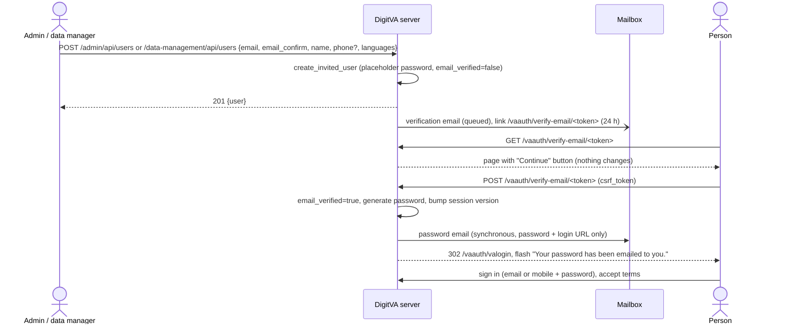
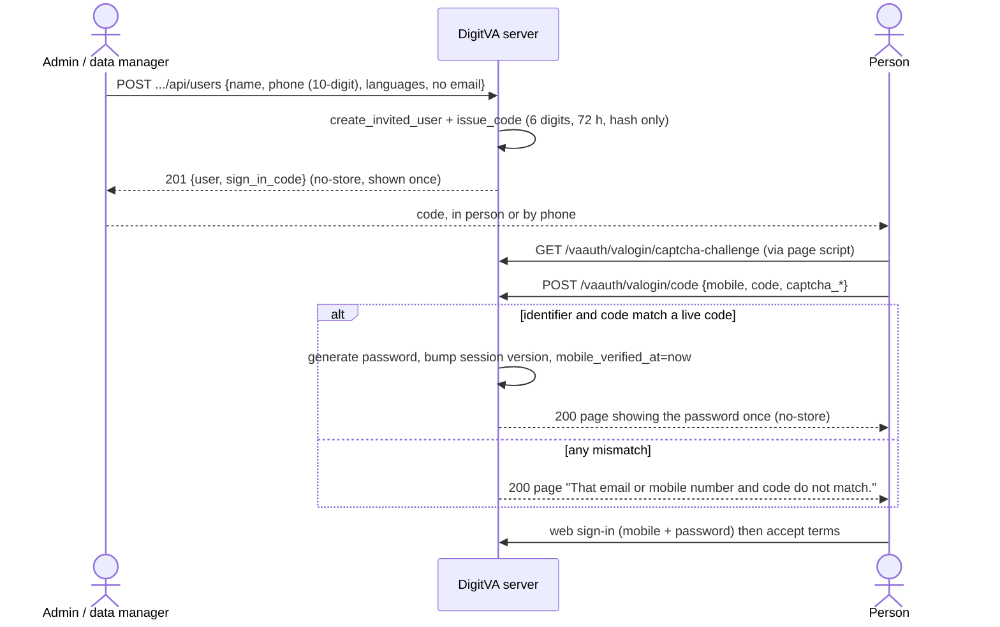
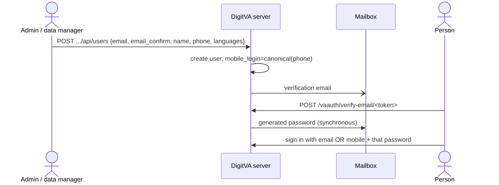
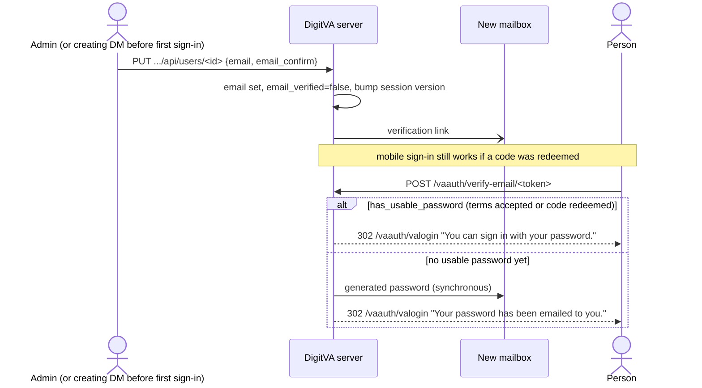

# Authentication, Login and Onboarding (shipped APIs)

What the server does today for account creation, onboarding, web login,
native-app device sign-in and the related recovery flows. It is written for
client builders (the Expo browser client and the native collection app;
bead `digitva-j13l`). Everything here was read from the code at `HEAD`
(commit `a76f9120`) unless it is marked **working tree**. Where the code and
the policy differ, this page describes the code and says so in
[HEAD versus policy](#11-head-versus-policy).

Policies (intent): [account onboarding and passwords](../policy/account-onboarding-and-passwords.md),
[mobile sign-in](../policy/mobile-sign-in.md),
[authentication factors](../policy/authentication-factors.md),
[field data collection](../policy/field-data-collection.md),
[Expo client](../policy/expo-client.md). Related current state:
[device collection API](device-collection-api.md),
[Expo client hosting and bootstrap](expo-client.md).

Code:

| Area | File |
| --- | --- |
| Web login, code redemption, emailed links | `app/routes/va_auth.py` (blueprint `va_auth`, prefix `/vaauth`) |
| Terms page | `app/routes/profile.py` (`/profile/force-password-change`) |
| Profile JSON (password, reauth, passkeys, TOTP, recovery codes) | `app/routes/api/profile.py` (`/api/v1/profile`) |
| Device API | `app/routes/api/device.py` (`/api/v1/device`), `app/services/device_auth_service.py` |
| Device enrolment codes (admin) | `app/routes/admin_devices.py` |
| Account creation, phone rules | `app/services/user_account_service.py` |
| Sign-in codes, generated passwords | `app/services/mobile_sign_in_service.py` |
| Emailed-link tokens | `app/services/token_service.py` |
| Email sending | `app/services/email_service.py` |
| Passkeys, TOTP, recovery codes | `app/services/webauthn_service.py`, `app/services/totp_service.py` |
| CAPTCHA | `app/services/pow_captcha_service.py` |
| Session gates (terms, maintenance, factor enrolment) | `app/__init__.py` (`force_password_update`, `enforce_factor_setup`) |
| Loaders, session version | `app/models/va_users.py` (`load_user`, `load_user_from_device_token`) |
| Forms | `app/forms/va_login_form.py`, `app/forms/password_reset_form.py`, `app/forms/va_pwresettnc_form.py` |
| Admin and data-manager user endpoints | `app/routes/admin.py`, `app/routes/data_management.py`, `app/routes/admin_mentor_institute.py`, `app/routes/admin_organization.py` |
| CLI | `app/commands/users.py`, `app/commands/auth.py`, `app/commands/devices.py` |

## 1. Overview

**Identifiers.** Every account (`va_users`) has an email, a sign-in mobile
number, or both (check constraint `email_or_mobile`).

- **Email**: stored lower-cased, unique. A typed value containing `@` is an
  email everywhere (login, code redemption, forgot password, device sign-in).
- **Mobile**: any typed value without `@` is read as a mobile number and
  canonicalised by `canonical_mobile`: keep digits only, drop a leading `0`
  (11 digits) or `91` (12 digits); the result must be exactly 10 digits, or
  it is not a number at all and matches no account. The canonical number is
  stored in `va_users.mobile_login` (unique). The free-text `phone` column
  keeps what was typed; `assign_phone` keeps `mobile_login` in step with it
  and refuses a number another account holds (in `mobile_login` or as the
  canonical form of its `phone`). Shared or malformed legacy numbers are
  never put in `mobile_login`, so they sign in by email only.
- `is_mobile_only` is `email IS NULL`. `sign_in_verified` is
  `email_verified OR mobile_verified_at IS NOT NULL` (a verified email, or a
  redeemed sign-in code). Login refuses an account that is not
  `sign_in_verified`.

**Nobody chooses a password.** There is no "set" or "change password"
endpoint, form or CLI prompt. `PUT /admin/api/users/<id>` refuses a
`password` key (400 "Passwords are generated, never set. ..."). Every
password comes from `mobile_sign_in_service.generate_password`:

- Three words from the bundled list (`mobile_password_words.txt`, 1823
  lowercase English words of 4 to 7 letters) and a 4-digit number joined by
  `-`, for example `maple-otter-candle-4821`. Always 19 to 26 characters,
  about 45.8 bits, drawn with `secrets`.
- Checked against the breach list; a hit is redrawn (up to 5 draws). If the
  breach check cannot be reached the flow raises
  `PasswordGenerationUnavailable`, changes nothing and shows the breach-check
  outage message (HTTP 503 on the profile JSON endpoint).
- Setting it always bumps the account's session version (section 3.6), so
  the old password and every session end.
- A password is delivered once: by a synchronous email
  (`send_password_email`, never through Celery; subject "Your DigitVA
  password", carrying the password and the login page address only), or on
  one `Cache-Control: no-store` response (code redemption, profile generate
  for an account without a verified email, CLI terminal). It is never logged.

**Who creates accounts** (nobody self-registers; every path calls
`validate_new_user_payload` + `create_invited_user`, or the import's
equivalent):

| Path | Who | Mobile-only allowed |
| --- | --- | --- |
| `POST /admin/api/users` | admin | yes |
| `POST /data-management/api/users` (with one initial grant the caller may write) | `role_required("data_manager", "admin")`; the data-manager gate is effective roles: a `data_manager` grant, a unit `site_pi` (In-charge) or a `project_pi` on a tree project | yes |
| `POST /admin/api/organization/<project_id>/project-users/import` (CSV/XLSX, `dry_run` default on) | admin, project_pi | new mobile-only rows: admin only |
| `POST /admin/api/mentor-institutes/<code>/staff` | admin, mentoring-institute admin (20 per day per caller; admin exempt) | platform admin only |
| `flask users create` | shell access | yes (password printed once) |

A new account is active, `email_verified = False`, `pw_reset_t_and_c =
False` (terms not accepted), and holds a random unknown placeholder password
(`secrets.token_urlsafe(32)`) until a generated one replaces it.

## 2. Onboarding per account type

### 2.1 Email account

1. Creator saves the account. After commit `send_invitation` queues the
   verification email (`email_verify` token, 24 hours, bound to the current
   email). Failure is logged without the address and swallowed; the creator
   can resend.
2. The person opens `/vaauth/verify-email/<token>`. GET shows a button and
   changes nothing.
3. POST (button, CSRF) marks the email verified (`email_verified` audit
   event). Because the account has no usable password yet
   (`has_usable_password` is false: terms never accepted and no code ever
   redeemed), the server generates one, bumps the session version and
   emails it synchronously. If generation or the email fails, everything
   rolls back (the email stays unverified) and the page asks to retry.
4. Flash "Your email is verified. Your password has been emailed to you."
   and redirect to `/vaauth/valogin`. The page never shows the password.
5. The person signs in (section 3), accepts the terms on first sign-in, and
   privileged users enrol a factor if enforcement is on.



### 2.2 Mobile-only account

1. Creator saves the account with a name, a 10-digit mobile no other
   account holds, languages, and no email. The same transaction issues a
   6-digit sign-in code (`issue_code`); the create response carries it once
   as `sign_in_code` (`Cache-Control: no-store`). No email is sent.
2. The creator hands the code over in person or by phone. It is valid 72
   hours, works once, and five wrong attempts void it.
3. The person opens `/vaauth/valogin/code` ("I have a code"), enters the
   mobile number and code, and solves the CAPTCHA.
4. On a match the server generates a password, bumps the session version,
   sets `mobile_verified_at`, and shows the password once on that response
   ("Write this down. It will not be shown again.", `no-store`). A refresh
   re-posts a spent code and fails.
5. The person signs in on the web with the mobile number and password and
   accepts the terms. Only then does device sign-in work (section 6.5).



### 2.3 Account with both email and mobile

Created like 2.1 with a `phone` that canonicalises: `mobile_login` is set
at creation. Nothing is mailed to or about the mobile. Verifying the email
(2.1 step 3) makes the account `sign_in_verified`, so from then the person
may type either the email or the mobile number at login; no code is needed.
Before verification neither works (the password is still the unknown
placeholder).



### 2.4 Email added to an existing account

- **Who.** An admin, any time (`PUT /admin/api/users/<id>`). A data manager
  only on an account it created (`other.created_by_user_id`) that has never
  signed in (no verified email and no redeemed code)
  (`PUT /data-management/api/users/<id>`); otherwise 403 "You may update
  email only for users created by you who have not signed in yet."
- **Effect of any email change** (both endpoints): `email_verified = False`,
  session version bumped (every web session, remember cookie and device
  session ends), a verification link to the new address after commit (send
  failures ignored).
- **Signing in meanwhile.** A mobile account that already redeemed a code
  stays `sign_in_verified` (via `mobile_verified_at`), so it keeps signing
  in by mobile. An email account whose address was changed and that never
  redeemed a code cannot sign in until the new address is verified ("Please
  verify your email address before logging in.").
- **Verifying it** keeps the existing password when `has_usable_password`
  is true (terms accepted, or a code redeemed): flash "Your email is
  verified. You can sign in with your password." From then "Forgot
  password" works by email.



## 3. Web login

All pages are server-rendered Flask-WTF forms posting `csrf_token` (section
8.1). Clients use these pages; they do not reimplement them.

### 3.1 Identifier step: `GET|POST /vaauth/valogin`

- A signed-in visitor is redirected to `landing_url()`. Every visit clears
  any pre-auth state ("not you?" goes back here).
- The page fetches `GET /vaauth/valogin/captcha-challenge`, which returns
  `{"salt", "difficulty", "expires", "signature"}` (HMAC-SHA256 under
  `CAPTCHA_HMAC_KEY`; lifetime 300 seconds; difficulty `CAPTCHA_DIFFICULTY`,
  default 14). The browser (`app/static/js/pow_captcha.js`, Web Worker)
  finds a decimal integer `n` such that `SHA-256(salt + str(n))` has
  `difficulty` leading zero bits, and posts `email`, `captcha_salt`,
  `captcha_difficulty`, `captcha_expires`, `captcha_signature`,
  `captcha_solution`. The server checks signature, expiry, solution, then
  claims the challenge once (atomic cache add); a solved challenge works
  once.
- A failed CAPTCHA re-renders with "We couldn't verify that request. Please
  try again."
- On success the server stores the pre-auth state in the server-side
  session (`session["preauth"]`: the lower-cased email, or the canonical
  mobile, or `""` for a non-number; `issued_at`; safe `next`) **without
  looking the account up**, and redirects to `/vaauth/valogin/password`
  (keeping `?next=`). Pre-auth expires 5 minutes after this step.
- A value with `@` must be a valid email (form error); a value without `@`
  is never refused here.
- Maintenance after the cutoff shows "Site is under maintenance. Only admin
  login is allowed right now." on the page.
- `next` is accepted only if `_safe_next_url` passes: a path starting with a
  single `/`, or an absolute http(s) URL on this host; no backslashes,
  whitespace or control characters.

### 3.2 Second page: `GET|POST /vaauth/valogin/password`

The same page for every identifier, known or not: "Signing in as <typed
value>", a passkey button and a password form (`password`, `remember_me`).
No pre-auth state, or expired: redirect to `/vaauth/valogin` with "Please
sign in again."

Password POST, in order:

1. Look up the account named by the pre-auth state (email, or
   `mobile_login`). Unknown: a dummy hash check is spent for equal timing.
2. Unknown account, wrong password or inactive account: flash
   `INVALID_LOGIN_MESSAGE` "Invalid email or password. Please, re-check and
   login again." and back to this page.
3. Not `sign_in_verified`: an email account gets "Please verify your email
   address before logging in." (flash category `email_unverified`); a
   mobile-only account gets the invalid-login message.
4. Non-admin after the maintenance cutoff: "Site is under maintenance. Only
   admin login is allowed right now."
5. `totp_service.needs_second_factor(user)`: the verified password is bound
   to the pre-auth state (`second_factor_user_id`, failure counter 0,
   `remember`) and the browser goes to `/vaauth/valogin/second-factor`.
6. Otherwise `_complete_login` (section 3.5) and redirect to `next` or the
   landing page.

Passkey path (JSON, `X-CSRFToken` header):

- `POST /vaauth/valogin/passkey/options` (empty body) returns WebAuthn
  request options: discoverable credentials, no `allowCredentials`,
  `userVerification: "required"`, RP ID `WEBAUTHN_RP_ID`. Identical for every
  identifier. No pre-auth: 400 `{"error": "Please sign in again."}`. The
  challenge lives in the session for 5 minutes and is consumed on first use.
- `POST /vaauth/valogin/passkey/verify` with `{"credential": <PublicKeyCredential JSON>}`.
  The credential must belong to the account the pre-auth state names; a
  credential of another account, or of none, a malformed body, a failed
  signature, a counter regression (non-zero stored counter not exceeded;
  `counter_regression` event) or a lost race on the counter update all
  answer 400 `{"error": INVALID_LOGIN_MESSAGE}`. Unverified: 400
  `{"error": "Please verify your email address before logging in."}`.
  Maintenance: 400 with the maintenance message. Success: 200
  `{"redirect": <next or landing URL>}`. A passkey sign-in needs no second
  factor and is never "remembered" (`remember=False`).

### 3.3 Second factor: `GET|POST /vaauth/valogin/second-factor`

Reachable only after a correct password in the same live pre-auth state;
otherwise "Please sign in again." Field `code` takes a current TOTP code
(6 digits, 30 s step, one step of drift, replay of the last accepted step
refused) or an unused recovery code (`XXXXX-XXXXX`, case and hyphens/spaces
ignored).

`needs_second_factor` is true when the account has a confirmed TOTP (any
role), or is privileged (`is_admin()` or `is_data_manager()`) and holds any
passkey or TOTP. A privileged user with only passkeys uses a passkey, or
password plus a recovery code.

Wrong code: "Invalid code. Please try again." The fifth failure in one
pre-auth state clears it, records `second_factor_lockout`, and sends the
person to the identifier step with "Too many attempts. Please sign in
again." A recovery code records `recovery_code_used` (`remaining`).
Maintenance is checked again before completing.

### 3.4 Enrolment window and forced factor setup

`enforce_factor_setup` (every request except `/static`, `/health` and
`/api/v1/device/`) applies to a signed-in privileged user when
`AUTH_FACTOR_ENFORCE_FROM` (ISO date) has passed, or when the session
carries `factor_setup_forced` (set by a break-glass factor-reset link). If
the user has no passkey and no confirmed TOTP (cached per session in
`factor_setup_needed`, cleared when Profile changes a factor):

- HTML pages redirect to `/profile/#passkeys-card`.
- API paths (`/api/`, `/admin/api/`, `/data-management/api/`, ...) answer
  403 `{"error": "factor_setup_required"}`.
- Exempt: `profile.view`, `profile.force_password_change`, every
  `va_auth.*` endpoint and every `/api/v1/profile/*` endpoint.

No lock-out: password sign-in still works. Before the date nobody is held.
After a password sign-in by a user with no passkey, the base template shows
a dismissible passkey banner (`session["passkey_nudge"]`,
`POST /api/v1/profile/dismiss-passkey-nudge`).

### 3.5 Terms acceptance: `GET|POST /profile/force-password-change`

`force_password_update` runs on every request for a signed-in session.
While `pw_reset_t_and_c` is false, every endpoint except `static`,
`profile.force_password_change`, `va_auth.va_logout`, `va_auth.va_login`,
`va_auth.forgot_password`, `va_auth.reset_password`, `va_auth.verify_email`
and `va_auth.resend_verification` answers **302 to
`/profile/force-password-change`**, JSON API paths included (the name is
historical; no password changes there). The page posts `accept_terms`
(required checkbox) and `csrf_token`; success sets `pw_reset_t_and_c =
True`, flashes "Terms accepted successfully." and redirects to
`/coding/` (`coding.dashboard`), not to `next`. POST is limited to 5 per
minute.

`pw_reset_t_and_c` is false on every new account and is set false again by
the reset-link POST (section 5.2). Code redemption and Profile generate do
not change it. This gate runs before the factor gate.

### 3.6 Sessions, remember, logout, session version

- `_complete_login` (password, second factor, passkey, factor-reset link)
  clears the pre-auth state and the WebAuthn challenge, clears the whole
  session (fixation), marks it permanent, calls `login_user(user,
  remember=...)`, sets `auth_verified_at` (opens the 10-minute
  reauthentication window, section 5.6) and regenerates the session id.
- Server-side sessions (Flask-Session, table `va_sessions`), signed cookie,
  `PERMANENT_SESSION_LIFETIME` 30 minutes. "Remember me" sets the
  Flask-Login remember cookie for 30 days (`REMEMBER_COOKIE_DURATION`). Both
  cookies are `HttpOnly`, `Secure` in production, `SameSite=Lax` by default.
- Flask-Login identifies a session as `<user_id>` or `<user_id>:<version>`.
  `load_user` rejects an inactive user or a version mismatch, so a bump ends
  every web session and remember cookie at the next request.
- **Session version bumps** (`bump_session_version`): every generated
  password (code redemption, first password at email verification,
  reset-link POST, Profile generate, CLI create of a mobile-only account,
  CLI `reset-password`), `reset_factors` (admin and CLI), the factor-reset
  link POST, and any email change by an admin or data manager. Not bumped:
  logout, terms acceptance, deactivation (deactivation is caught instead by
  the `is_active` check in `load_user`, `role_required` and the device
  checks). A bump also ends device sessions (section 6.4).
- `POST /vaauth/valogout` (CSRF) calls `logout_user()` (also clears the
  remember cookie) and redirects to `/`. An anonymous POST just redirects.
- A non-admin signed in when the maintenance cutoff starts is logged out at
  the next request: HTML redirects to the login page, API paths get 401
  `{"error": "Site is under maintenance. Only admin login is allowed right now."}`.

## 4. Sign-in codes

### 4.1 Issuing

| Endpoint | Who | Rule |
| --- | --- | --- |
| `POST /data-management/api/users/<id>/sign-in-code` | data-manager gate | `may_issue_code`: the target holds at least one active grant, the caller may manage **every** active grant (`authz.grant_list_filter`), none of them is `admin`, `project_pi`, `site_pi` or `data_manager` or global-scoped, and the target has **no verified email**. Anyone failing this gets the same 404 "User not found." as an unknown id. 20 per hour per caller. |
| `POST /admin/api/users/<id>/sign-in-code` | admin | any account |
| account creation (admin, DM page, import, mentor staff) | as section 1 | automatically for a new mobile-only account |

`issue_code` locks the user row, voids any live code (`mobile_code_voided`,
reason `reissued`), stores only a keyed hash (bound to the user id), sets a
72-hour expiry, records `mobile_code_issued`, and returns the code once.
Responses: 200 `{"sign_in_code": "123456", "expires_in_hours": 72}`,
`Cache-Control: no-store`.

### 4.2 Redeeming: `GET|POST /vaauth/valogin/code`

Form fields: `mobile` (holds an email **or** a mobile number, max 128),
`code` (max 32), and the five `captcha_*` fields (same CAPTCHA as 3.1).
Limits: 10 per minute per IP and 10 per hour per identifier (canonical
mobile, or lower-cased email).

- The password is generated **before** the lookup, so a breach-check outage
  ("warning" flash, nothing read or written) cannot reveal whether the code
  was right.
- Every path runs the same statements. Unknown email, unknown, shared or
  malformed number, inactive account, no live code, wrong code: one answer,
  `INVALID_SIGN_IN_CODE_MESSAGE` "That email or mobile number and code do
  not match. Please check and try again." A wrong code increments the live
  code's counter under a row lock; the fifth voids it
  (`mobile_code_voided`, reason `too_many_attempts`).
- A match marks the code redeemed, sets the password, bumps the session
  version, sets `mobile_verified_at` if unset, and records
  `mobile_code_redeemed` and `password_generated` (`path: sign_in_code`).
- The response renders the password once with `Cache-Control: no-store` and
  `Pragma: no-cache`, plus a "Continue to sign in" link. The page offers no
  passkey (the person is not signed in); it points to Profile after sign-in.
- If the account has an email, a notice is queued to it ("Your DigitVA
  password was changed", no password, code or link). Its failure is logged
  and ignored.
- The person then signs in normally (section 3); every factor rule applies.

## 5. Recovery and account links

Every emailed link has a GET that shows a button and changes nothing (mail
scanners prefetch links) and a POST (the button, `csrf_token`) that acts.
Tokens are `itsdangerous` timed tokens:

| Purpose | Lifetime | Single use because |
| --- | --- | --- |
| `password_reset` | 1 hour | it fingerprints the password hash, which the POST changes |
| `email_verify` | 24 hours | it fingerprints the current email; reopening after verification shows "already verified" |
| `factor_reset` | 1 hour | it fingerprints the password hash and session version, which the POST bumps |

### 5.1 Forgot password: `GET|POST /vaauth/forgot-password`

Field `email` (email or mobile). 3 per hour per IP. Signed-in visitors are
redirected. Typing an identifier never changes a password.

- Email typed: if it names an account with a verified email, a reset link
  is queued to it. Always the same flash: "If that email address is
  registered, we've sent a password reset link. Please check your inbox (and
  spam folder)."
- Mobile typed: if `mobile_login` names an account with a verified email,
  the link goes to that email. Always the same flash
  (`MOBILE_FORGOT_MESSAGE`): "If that number belongs to an account with a
  verified email, we've sent a password reset link to that email. Otherwise
  ask your data manager for a new sign-in code, then use "I have a code" on
  the sign-in page."

### 5.2 Reset link: `GET|POST /vaauth/reset-password/<token>`

5 per minute per IP on POST. Invalid, expired, used, inactive or no-email
account: 200 page with `token_valid = False` ("This link is invalid or has
expired." in the template). POST: generate a password, bump the session
version, email it synchronously (`email_new_password`, path
`password_reset`), set `pw_reset_t_and_c = False` (terms again at next
sign-in), commit, flash "Your password has been emailed to you. Please sign
in with it." and redirect to `/vaauth/valogin`. The page shows no password
and has no password box. Generation or email failure rolls everything back
(the old password keeps working) and redirects to the same link with a
retry message. A CSRF failure re-renders with 400.

### 5.3 Verify email: `GET|POST /vaauth/verify-email/<token>`

5 per minute per IP on POST. Works signed in or not. Invalid or expired
link, or inactive account: flash "This verification link is invalid or has
expired. Please request a new one." and redirect to login. Already verified:
"Your email is already verified. You can sign in." POST behaviour: section
2.1 (first password) or 2.4 (keeps the password).

### 5.4 Resend verification: `GET|POST /vaauth/resend-verification`

Field `email`. 3 per hour per IP. A value without `@` gets
`MOBILE_RESET_MESSAGE` ("If you sign in with a mobile number, ask your data
manager for a new sign-in code, then use "I have a code" on the sign-in
page."). An email of an unverified account gets a new link. Same flash
either way: "If that email address needs verification, we've sent a new
link. Please check your inbox (and spam folder)."

### 5.5 Factor reset link: `GET|POST /vaauth/factor-reset/<token>`

Sent only by `flask auth reset-factors <email> --reason "..."` (which
first clears passkeys, TOTP and recovery codes, bumps the session version,
records `factor_reset` with `via: cli`, then emails the link synchronously;
it prints the link only if delivery failed). 5 per minute per IP on POST.
POST marks the email verified, bumps the session version again (spending
this and any other factor-reset link), signs the person in, sets
`factor_setup_forced`, and redirects to `/profile/#passkeys-card`. It sets
no password; the fresh sign-in leaves Profile "Generate a new password"
usable for 10 minutes. The terms gate still applies afterwards. The admin
"Reset sign-in factors" action (`POST /admin/api/users/<id>/reset-factors`)
does the same clearing and bump but sends a notice without a link.

### 5.6 Reauthentication: `POST /api/v1/profile/reauth`

JSON `{"password": "..."}`. Wrong or missing: 403 `{"error": "Incorrect
password."}`. Success sets `auth_verified_at` and returns
`{"message": "Reauthenticated."}`. 5 per minute per user. Password only:
there is no passkey reauthentication endpoint. A sign-in also opens the
window. The window is 10 minutes (`REAUTH_TTL`); endpoints that need it
answer 401 `{"error": "reauth_required"}` outside it.

### 5.7 Profile "Generate a new password": `POST /api/v1/profile/password/generate`

Signed in, `X-CSRFToken`, empty body, needs the reauthentication window,
5 per hour per user. `Cache-Control: no-store`.

- Account with a verified email: password emailed;
  200 `{"message": "Your new password has been emailed to you."}`.
- Any other account (mobile-only, or an email still unverified):
  200 `{"password": "...", "message": "Write this down. It will not be shown again."}`.
- Either way the old password and every session end, this one included:
  the client must send the person to sign in again.
- Breach-check outage or email failure: 503 `{"error": <message>}`, nothing
  changed.

## 6. Native app (device API)

Bearer only, CSRF-exempt, no cookies (`csrf.exempt(bp)`; a browser session
cookie never satisfies these endpoints). Errors are
`{"error": <message>, "code": <machine code>}`; the role gate's 401/403
bodies carry `error` only. Full data endpoints and tables:
[device collection API](device-collection-api.md).

### 6.1 Enrolment (QR)

An admin issues a code: `POST /admin/api/projects/<project_id>/device-enrolments`
`{"expires_in_minutes": 5..10080 (default 60), "max_uses": 1..200 (default 1)}`
returns 201 `{"code", "qr_payload", "qr_svg", "expires_at", "max_uses"}`
(`no-store`). `qr_payload` is compact JSON
`{"v":1,"server":<DEVICE_PUBLIC_URL>,"enroll":<code>,"project":<project_id>}`.
Refused 503 when `DEVICE_PUBLIC_URL` is plain http outside debug/testing
(except `localhost`, `127.0.0.1`, `10.0.2.2`); 404 for an inactive or
unknown project. CLI: `flask devices create-enrolment-code`.

The app posts `POST /api/v1/device/enroll`
`{"code", "device_name" (required, <= 64), "platform": "android", "app_version" (optional, <= 32)}`.
201 `{"device_id", "device_secret", "project": {"project_id", "name"}, "server_time"}`.
The code is consumed atomically; unknown, expired, revoked, used-up, or an
inactive project: 404 `enrolment_invalid`. The secret is shown once and
stored by the server only as a SHA-256 digest.

### 6.2 Device sign-in: `POST /api/v1/device/sessions`

Body `{"device_id", "device_secret", "email", "password", "otp"?}`. The
`email` field holds an email **or** a mobile number (field name kept for the
contract). Limits: 10 per minute per IP, 10 per minute per `device_id`, 20
per hour per identifier (canonical mobile for a number). Checks, in order:

| Check | Refusal |
| --- | --- |
| device id and secret | 401 `device_invalid` |
| device revoked or project inactive | 403 `device_revoked` |
| unknown identifier (timing equalised), wrong password, inactive account, or mobile-only account that never redeemed a code | 401 `invalid_credentials` "Invalid email or password." |
| not `sign_in_verified` | 403 `email_unverified` |
| terms not accepted (`pw_reset_t_and_c` false) | 403 `password_change_required` "Sign in on the website once and accept the terms before signing in here." |
| non-admin after the maintenance cutoff | 403 `maintenance` |
| `needs_second_factor`: 5 or more `second_factor_invalid` failures in the last 15 minutes since the last device sign-in | 429 `second_factor_locked` |
| `needs_second_factor`, no `otp` or a wrong one | 401 `second_factor_required` (the fifth wrong one records `second_factor_lockout`) |
| no interviewer grant reaching the device's project (`interviewer_context`, which skips projects with web intake off) | 403 `no_interviewer_grant` |

Every refusal after the device check is audited as `device_session_failed`
with the device id and reason only. Success records
`device_session_opened`.

### 6.3 Token responses

`POST /sessions` (201) and `POST /sessions/refresh` (200) return:

```json
{
  "access_token": "<opaque>",
  "access_expires_at": "<ISO 8601>",
  "refresh_token": "<opaque>",
  "refresh_expires_at": "<ISO 8601>",
  "user": {"user_id": "<uuid>", "name": "<display name>", "email": "<email or null>"}
}
```

`user.email` is `null` for a mobile-only account. The access token lives 15
minutes. The refresh token rotates on every use; its expiry slides by
`DEVICE_REFRESH_TTL_DAYS` (default 30) but never past
`DEVICE_SESSION_MAX_DAYS` (default 90) from sign-in.

### 6.4 Refresh and revoke

`POST /api/v1/device/sessions/refresh`
`{"refresh_token", "device_id", "device_secret"}` plus optional
outstanding-work fields (`count`, `unique_ids`, `client_draft_ids`,
`client_death_ids`). 30 per minute per IP. Refusals:

| Code | Status | Meaning | App action |
| --- | --- | --- | --- |
| `invalid_request` | 400 | `refresh_token` missing | fix the call |
| `device_invalid` | 401 | device id/secret wrong, or not this session's device; nothing revoked | re-enrol only if the device itself is unknown |
| `refresh_invalid` | 401 | unknown token | sign in again |
| `refresh_retry_race` | 409 | the token rotated away under 60 s ago was replayed (lost response); session revoked | sign in again, keep data |
| `refresh_reused` | 401 | an older retired token (one of the last 5) was replayed; session revoked | sign in again, keep data |
| `session_expired` | 401 | past sliding expiry or the absolute cap | sign in again, keep data |
| `session_ended` | 401 | account changed (session version bump: any new password, factor reset, email change; or deactivated) or project closed | sign in again, keep data |
| `session_revoked` | 401 | admin or device revoke, withdrawn interviewer grant, signed out | the only code on which the app wipes that interviewer's store |

Bearer calls with an access token whose account was bumped or deactivated
answer 401 `unauthorized` at once (`resolve_access_token` returns nothing);
the next refresh then answers `session_ended`. A withdrawn grant is caught
at the next refresh (within 15 minutes).

`DELETE /api/v1/device/sessions/current` (bearer, any signed-in role, so a
withdrawn interviewer can still sign out) revokes the session
(`signed_out`) and answers 204. Admin: `POST /admin/api/devices/<device_id>/revoke`
revokes the device and every session on it, answering
`{"device_id", "sessions_ended"}`.

### 6.5 What `password_change_required` means

It means only "terms not accepted": the code is kept for the app contract,
and no password change exists. It is returned whenever `pw_reset_t_and_c`
is false, which is the case for every new account until its first web
sign-in, and again after a reset-link password (section 5.2). Code
redemption does not set the flag, so a newly onboarded mobile-only person
must sign in once on the website (`/vaauth/valogin`) and accept the terms
before the app's sign-in succeeds. The app shows the message and a link to
the website; it does not retry with another password.

### 6.6 Factor rules on the device

- No WebAuthn on the device API: a passkey cannot be used to sign in there.
- When `needs_second_factor` is true the `otp` field is required and takes
  a TOTP code or a recovery code. A privileged user holding only passkeys
  must give a recovery code.
- Device lockout is counted per account from the audit trail (5 failures in
  15 minutes since the last successful device sign-in), separately from the
  web flow's per-pre-auth counter.
- The enrolment-enforcement redirect (section 3.4) and the terms redirect
  never run on `/api/v1/device/`; the terms gate is applied at device
  sign-in instead.

## 7. Browser client bootstrap: `GET /api/v1/client/bootstrap`

**Working tree only (not at HEAD; design `.tasks/digitva-p6fs-design.md`,
policy [Expo client](../policy/expo-client.md)).** `app/routes/api/client.py`,
registered under `/api/v1/client` in the working tree's
`app/routes/api/__init__.py`. Uses the ordinary session cookie. Every
response (errors and redirects included) is `Cache-Control: no-store`.

- Anonymous or inactive: 401
  `{"code": "authentication_required", "login_url": "/vaauth/valogin?next=/app/"}`.
- Signed in: 200

```json
{
  "user": {"id": "<uuid>", "name": "<display name>"},
  "csrf": {"header": "X-CSRFToken", "token": "<signed token>"},
  "capabilities": {"intake": true, "coding": false, "reviewing": false},
  "links": {
    "login": "/vaauth/valogin?next=/app/",
    "logout": "/vaauth/valogout",
    "intakeBootstrap": "/intake/api/bootstrap",
    "intakeCases": "/intake/api/cases",
    "intakeDrafts": "/intake/api/drafts",
    "coding": "/coding/",
    "reviewing": "/reviewing/"
  }
}
```

  `capabilities` come from `authz.effective_roles`: `intake` = interviewer,
  `coding` = coder or coding_tester, `reviewing` = reviewer. They are
  navigation hints; every workflow API checks scope itself.
- Terms not accepted (working-tree change in `force_password_update`): 403
  `{"code": "password_change_required", "redirect_url": "/profile/force-password-change"}`
  for this endpoint only; every other endpoint still answers the 302.
- Factor setup required (working-tree change in `enforce_factor_setup`):
  403 `{"error": "factor_setup_required", "code": "factor_setup_required", "redirect_url": "/profile/#passkeys-card"}`
  for this endpoint only.
- Non-admin during maintenance: 401
  `{"error": "Site is under maintenance. Only admin login is allowed right now."}`
  (the app-wide gate).

Until this ships, the HEAD behaviour for a browser client is: no bootstrap
endpoint; `/api/v1/profile/` gives the signed-in user (section 8); the
terms gate answers JSON calls with a 302 to an HTML page.

## 8. API reference

### 8.1 Conventions

- **CSRF.** `CSRFProtect` covers every POST, PUT, PATCH and DELETE except
  `/api/v1/device/*` (and two unrelated exemptions). Server-rendered forms
  carry a hidden `csrf_token` field; JSON calls send the token in the
  `X-CSRFToken` header (the only accepted header, `WTF_CSRF_HEADERS`). In
  production `WTF_CSRF_SSL_STRICT` also requires a same-origin `Referer`
  over HTTPS. Tokens are bound to the session, so a new session (after
  sign-in, which clears the session) needs a new token.
- **Default rate limit.** Every route also has the app default: 900 per
  hour and 12000 per day, keyed `user:<id>` when signed in, else per IP.
  The per-route limits below are added to it. A limit hit answers 429.
- **Temporary IP bans** (request-abuse service) answer 403 with
  `Retry-After` before anything else; JSON `{"error": ...}` on `/api/` and
  `/admin/api/` paths.
- "Form" means a server-rendered page that answers HTML with flash
  messages (200 page or 302), never JSON.

### 8.2 Web login and recovery (`/vaauth`, all public)

| Method, path | Request | Response | Limits | Indistinguishability | Audit |
| --- | --- | --- | --- | --- | --- |
| GET `/vaauth/valogin` | `?next=` | form; signed-in: 302 landing | default | never looks the account up | none |
| POST `/vaauth/valogin` | form: `email`, `captcha_salt`, `captcha_difficulty`, `captcha_expires`, `captcha_signature`, `captcha_solution`, `csrf_token` | 302 `/vaauth/valogin/password`; bad CAPTCHA: 200 form | 10/min per IP; 20/hour per identifier (lower-cased email or `mobile:<canonical>`) | same redirect for every identifier | none |
| GET `/vaauth/valogin/captcha-challenge` | none | 200 `{salt, difficulty, expires, signature}` | default | n/a | none |
| GET `/vaauth/valogin/password` | pre-auth session | form "Signing in as ..."; no pre-auth: 302 login | default | identical page for every identifier | none |
| POST `/vaauth/valogin/password` | form: `password`, `remember_me`, `csrf_token` | 302 next/landing, or 302 second factor, or 302 back with flash | 10/min per IP; 20/hour per pre-auth identifier | unknown, wrong password and inactive give one message; dummy hash for unknown | none |
| POST `/vaauth/valogin/passkey/options` | JSON `{}`, `X-CSRFToken` | 200 WebAuthn request options; 400 `{"error": "Please sign in again."}` | 10/min per IP; 20/hour per pre-auth identifier | identical for every identifier, no `allowCredentials` | none |
| POST `/vaauth/valogin/passkey/verify` | JSON `{"credential": {...}}`, `X-CSRFToken` | 200 `{"redirect"}`; 400 `{"error"}` | same | wrong account, unknown credential and bad signature give one message | `counter_regression` |
| GET/POST `/vaauth/valogin/second-factor` | form: `code`, `csrf_token` | 302 next/landing; 302 back; 302 login on lockout | POST 10/min per IP; 20/hour per pre-auth identifier | n/a (after a correct password) | `second_factor_lockout`, `recovery_code_used` |
| POST `/vaauth/valogout` | form or `X-CSRFToken` | 302 `/` | default | n/a | none |
| GET `/vaauth/site-maintenance-status` | none | 200 `{"maintenance": {...} or null}` | default | n/a | none |
| GET/POST `/vaauth/valogin/code` | form: `mobile` (email or mobile), `code`, `captcha_*`, `csrf_token` | 200 password page (`no-store`, `Pragma: no-cache`); 200 form with flash | POST 10/min per IP; 10/hour per identifier | unknown identifier, inactive, no code, wrong code: one message; password generated before lookup | `mobile_code_redeemed`, `password_generated` (`sign_in_code`), `mobile_code_voided` (`too_many_attempts`) |
| GET/POST `/vaauth/forgot-password` | form: `email` (email or mobile) | 302 back with flash | POST 3/hour per IP | one message per identifier kind | none |
| GET/POST `/vaauth/reset-password/<token>` | form: `csrf_token` | GET page; POST 302 login; invalid: 200 page `token_valid=False`; CSRF fail: 400 | POST 5/min per IP | n/a | `password_generated` (`password_reset`) |
| GET/POST `/vaauth/verify-email/<token>` | form: `csrf_token` | GET page; POST 302 login with flash | POST 5/min per IP | n/a | `email_verified`, `password_generated` (`email_verification`) when a first password is sent |
| GET/POST `/vaauth/resend-verification` | form: `email` | 302 back with flash | POST 3/hour per IP | one message for every email; mobile gets the code advice | none |
| GET/POST `/vaauth/factor-reset/<token>` | form: `csrf_token` | POST 302 `/profile/#passkeys-card` (signed in) | POST 5/min per IP | n/a | none at this step (the CLI recorded `factor_reset`) |
| GET/POST `/profile/force-password-change` | signed in; form: `accept_terms`, `csrf_token` | 302 `/coding/` | POST 5/min | n/a | none |

### 8.3 Profile JSON (`/api/v1/profile`, signed in, cookie session)

All mutating calls need `X-CSRFToken`. These use `login_required`, so an
unauthenticated call answers **302 to `/vaauth/valogin?next=...`** (HTML),
not a JSON 401 (`login.login_view = "va_auth.va_login"`). "Reauth" means the 10-minute window
(else 401 `{"error": "reauth_required"}`). Per-user limits key on the
signed-in user id.

| Method, path | Request | Response | Limits | Audit |
| --- | --- | --- | --- | --- |
| GET `/` | none | `{user_id, name, email (may be null), mobile_only, languages, timezone, year_of_birth, sex}` | default | none |
| POST `/password/generate` | none; reauth | 200 `{message}` or `{password, message}` (`no-store`); 503 `{error}` | 5/hour per user | `password_generated` (`profile`) |
| POST `/reauth` | `{"password"}` | 200 `{message}`; 403 `{"error": "Incorrect password."}` | 5/min per user | none |
| GET `/passkeys` | none | `{"passkeys": [{id, name, created_at, last_used_at, backed_up}]}` | default | none |
| POST `/passkeys/options` | reauth | WebAuthn creation options (resident key and user verification required) | 10/min, 20/hour per user | none |
| POST `/passkeys` | `{"credential", "name"?}`; reauth | `{message, passkey, recovery_codes?}`; 400 on failure or duplicate | 10/min, 20/hour per user | `passkey_registered`, `recovery_codes_generated` (first factor) |
| PATCH `/passkeys/<id>` | `{"name"}`; reauth | `{message, passkey}`; 404 | 10/min, 20/hour per user | `passkey_renamed` |
| DELETE `/passkeys/<id>` | reauth | `{message}`; 404; 409 last factor | 10/min, 20/hour per user | `passkey_revoked` |
| POST `/dismiss-passkey-nudge` | none | `{message}` | default | none |
| GET `/totp` | none | `{"enrolled": bool}` | default | none |
| POST `/totp/enroll` | reauth | `{secret, provisioning_uri, qr_svg}` | 10/min, 20/hour per user | none |
| POST `/totp/confirm` | `{"code"}`; reauth | `{message, recovery_codes?}`; 400 "Invalid code." | 10/min, 20/hour per user | `totp_enrolled`, `recovery_codes_generated` (first factor) |
| DELETE `/totp` | reauth | `{message}`; 404 not enrolled; 409 last factor | 10/min, 20/hour per user | `totp_removed` |
| GET `/recovery-codes` | none | `{"remaining": n}` | default | none |
| POST `/recovery-codes/regenerate` | reauth | `{"recovery_codes": [10 codes]}` | 10/min, 20/hour per user | `recovery_codes_generated` |

The 409 "You cannot remove your last sign-in factor." applies only to a
privileged user after `AUTH_FACTOR_ENFORCE_FROM`.

### 8.4 Device API (`/api/v1/device`, CSRF-exempt)

| Method, path | Auth | Request | Response | Limits | Audit |
| --- | --- | --- | --- | --- | --- |
| POST `/enroll` | none | `{code, device_name, platform: "android", app_version?}` | 201 `{device_id, device_secret, project, server_time}`; 400 `invalid_request`; 404 `enrolment_invalid` | 10/min per IP | `device_enrolled` |
| POST `/sessions` | device id + secret | `{device_id, device_secret, email (email or mobile), password, otp?}` | 201 token response; refusals in 6.2 | 10/min per IP; 10/min per device; 20/hour per identifier | `device_session_opened`, `device_session_failed`, `second_factor_lockout`, `recovery_code_used` |
| POST `/sessions/refresh` | device id + secret + refresh token | `{refresh_token, device_id, device_secret, count?, unique_ids?, client_draft_ids?, client_death_ids?}` | 200 token response; refusals in 6.4 | 30/min per IP | `device_session_revoked` |
| DELETE `/sessions/current` | Bearer | none | 204 | default | `device_session_revoked` (`signed_out`) |

Request bodies over 16 KB (256 KB on refresh) answer 413
`payload_too_large`. Data endpoints (`/bootstrap`, `/units`, `/cases`,
`/submissions`, ...): [device collection API](device-collection-api.md).

### 8.5 Admin and data-manager account endpoints

All JSON, cookie session, `X-CSRFToken` on writes, `role_required` gates
(401 `{"error": "Authentication required."}` / 403
`{"error": "<roles> access is required."}`). Error bodies are
`{"error": ...}`.

| Method, path | Who | Request | Response | Limits | Notes, audit |
| --- | --- | --- | --- | --- | --- |
| POST `/admin/api/users` | admin | `{email?, email_confirm?, name, phone?, languages[]}` | 201 `{user, sign_in_code?}` (`no-store`); 400 | default | email account: verification queued; mobile-only: code issued (`mobile_code_issued`) |
| PUT `/admin/api/users/<id>` | admin | any of `email`+`email_confirm`, `name`, `phone`, `year_of_birth`, `sex`, `status`, `languages` | 200 `{user}`; 400 (incl. `password` key refused) | default | email change bumps session version and sends a link; `phone` via `assign_phone` |
| POST `/admin/api/users/<id>/resend-verification` | admin | none | `{message}`; 400 already verified; 500 | default | see section 11 item 8 |
| POST `/admin/api/users/<id>/send-password-reset` | admin | none | `{"message": "Password reset link sent."}`; 400 no verified email or delivery off; 500 | default | queues a reset link; the link generates the password |
| POST `/admin/api/users/<id>/sign-in-code` | admin | none | `{sign_in_code, expires_in_hours: 72}` (`no-store`) | default | any account; `mobile_code_issued` |
| POST `/admin/api/users/<id>/toggle` | admin | none | `{user_id, status}`; 400 for self | default | deactivation ends sessions via `is_active` |
| POST `/admin/api/users/<id>/reset-factors` | admin | `{"reason"}` | `{message, user_id, email_sent}`; 400 self or no reason | default | `factor_reset` (`via: admin`); session version bump |
| POST `/admin/api/projects/<project_id>/device-enrolments` | admin | `{expires_in_minutes?, max_uses?}` | 201 `{code, qr_payload, qr_svg, expires_at, max_uses}` | default | `device_enrolment_code_created` |
| POST `/admin/api/devices/<device_id>/revoke` | admin | none | `{device_id, sessions_ended}` | default | `device_revoked` |
| POST `/admin/api/organization/<project_id>/project-users/import` | admin, project_pi | multipart `file` (CSV/XLSX, 1 MB), `dry_run` (`"0"` to apply) | `{dry_run, rows, created_users, sign_in_codes: [{row, mobile (masked), name, sign_in_code}]}` (`no-store`) | default | new mobile-only rows admin only |
| POST `/admin/api/mentor-institutes/<code>/staff` | admin, mentoring-institute admin | user fields as above | 201 `{staff, sign_in_code?}` (`no-store`) | 20/day per caller, admin exempt | mobile-only: platform admin only; "taken" refusals generic for non-admins |
| POST `/data-management/api/users` | data-manager gate | user fields + `initial_role`, `initial_scope_type` (`project`, `project_site`, `org_unit`), `initial_project_id`, optional `initial_project_site_id`, `initial_org_unit_id`, `initial_cadre_id` | 201 `{user, sign_in_code?}` (`no-store`); 400; 403 grant refused | default | creates the account and one grant the caller may write |
| GET `/data-management/api/users/lookup` | data-manager gate | `?value=` full email or mobile | `{"users": [{user_id, name, email, status, posts}]}` | 10/min | active accounts only, no partial match |
| PUT `/data-management/api/users/<id>` | data-manager gate | `email`+`email_confirm` and/or `languages` | 200 `{user}`; 403 email edit not allowed; 404 | default | email only for own never-signed-in accounts |
| POST `/data-management/api/users/<id>/resend-verification` | data-manager gate | none | `{message}`; 400 mobile-only or verified; 404; 500 | default | |
| POST `/data-management/api/users/<id>/sign-in-code` | data-manager gate | none | `{sign_in_code, expires_in_hours: 72}` (`no-store`); 404 when not allowed | 20/hour per caller | `may_issue_code` (section 4.1) |

CLI (shell access is the safeguard): `flask users create` (email: link, or
with `--email-verified` the password is emailed now; no email: password
printed once and `mobile_verified_at` set), `flask users reset-password
--email|--mobile [--onboarded|--require-password-change]` (prints a new
password once, ends sessions), `flask auth reset-factors <email> --reason`,
`flask devices create-enrolment-code`.

## 9. Error codes and messages clients must handle

Web pages (flash text, exact):

| Message | When |
| --- | --- |
| "We couldn't verify that request. Please try again." | CAPTCHA failed (identifier step, code page) |
| "Please sign in again." | pre-auth missing or expired (5 minutes) |
| "Invalid email or password. Please, re-check and login again." | any password or passkey failure |
| "Please verify your email address before logging in." | email account not verified |
| "Site is under maintenance. Only admin login is allowed right now." | maintenance cutoff |
| "Invalid code. Please try again." | wrong second factor |
| "Too many attempts. Please sign in again." | fifth wrong second factor |
| "That email or mobile number and code do not match. Please check and try again." | code redemption failed |
| breach-check outage message (`BREACH_CHECK_UNAVAILABLE_MESSAGE`) | password generation unavailable; retry later |
| "We could not send your password email. Please try again in a few minutes." | password email failed; nothing changed |

JSON:

| Status, body | Where | Meaning |
| --- | --- | --- |
| 302 to `/profile/force-password-change` | any signed-in endpoint at HEAD, JSON included | terms not accepted; a client must not follow it as data (use `redirect: "manual"` or check `response.redirected`) |
| 403 `{"error": "factor_setup_required"}` | API paths | privileged user must enrol a passkey or TOTP at `/profile/#passkeys-card` |
| 401 `{"error": "Authentication required."}` | `role_required` APIs | not signed in, or inactive |
| 302 to `/vaauth/valogin?next=...` | `login_required` APIs (`/api/v1/profile/*`) | not signed in |
| 401 `{"error": "Site is under maintenance. ..."}` | any API | non-admin logged out by maintenance |
| 401 `{"error": "reauth_required"}` | profile | reauthenticate (5.6) then retry |
| 503 `{"error": ...}` | profile password generate | breach check or email unavailable |
| 429 | anywhere | rate limit |
| 403 + `Retry-After` | anywhere | temporary IP ban |
| device codes | `/api/v1/device/*` | `invalid_request`, `payload_too_large`, `enrolment_invalid`, `device_invalid`, `device_revoked`, `invalid_credentials`, `email_unverified`, `password_change_required`, `maintenance`, `second_factor_required`, `second_factor_locked`, `no_interviewer_grant`, `unauthorized`, `refresh_invalid`, `refresh_reused`, `refresh_retry_race`, `session_expired`, `session_ended`, `session_revoked` (sections 6.2 and 6.4) |
| working tree only | `/api/v1/client/bootstrap` | `authentication_required` (401), `password_change_required` (403 + `redirect_url`), `factor_setup_required` (403 + `redirect_url`) |

## 10. Things clients must never do

- Never store a password, in any storage, log, crash report or analytics
  event. The native app keeps only its device secret and session tokens;
  device unlock (PIN, biometric) is local and is not a password.
- Never assume `email` is non-null (`user.email` in token responses,
  `email` in `/api/v1/profile/`, user lists). Display the name; a mobile
  number, when shown at all, is masked (`******3210`).
- Never build a native code-redeem, forgot-password, reset or verify
  screen that calls these endpoints directly. `/vaauth/valogin/code` and
  the link pages are HTML forms with CSRF and CAPTCHA; open the server page
  (browser or in-app browser). The show-once password exists only on that
  server response.
- Never offer a "set password" or "change password" form; the server has no
  endpoint for it. Use Profile "Generate a new password" or the flows in
  section 5.
- Never call `/vaauth/valogin/password` or the passkey endpoints without the
  identifier step first; never cache or replay a CAPTCHA solution.
- Never send a device bearer token anywhere but `/api/v1/device/`, and never
  use a browser cookie session on the device API.
- Never wipe local interview data on any code except `session_revoked`;
  `session_ended`, `session_expired`, `refresh_reused` and
  `refresh_retry_race` mean "sign in again, keep data".
- Never treat `password_change_required` as a password problem: send the
  person to the website to accept the terms.
- Never follow the terms-gate 302 from a JSON call as if it were data, and
  never treat bootstrap capabilities as permission.
- Never put an identifier, code or password in a URL, query string or log.
- After Profile "Generate a new password", sign the person in again: their
  own session has ended.

## 11. HEAD versus policy

1. **Reauthentication** (authentication-factors section 7 says password or
   passkey): only `POST /api/v1/profile/reauth` with a password exists; a
   passkey refreshes the window only by signing in again.
2. **Privileged users** (policy: an active `admin` or `data_manager`
   grant): the code uses `is_admin() or is_data_manager()`, and
   `is_data_manager` is effective roles, so a unit `site_pi` (In-charge) and
   a `project_pi` on a tree project are privileged too (second factor,
   enrolment enforcement, last-factor guard).
3. **App sign-in after onboarding** (onboarding 5.2 step 4 and section 7
   imply the person may sign in in the app at once): device sign-in refuses
   403 `password_change_required` until the terms are accepted on the
   website. Code redemption does not set the flag, and a reset link clears
   it.
4. **Profile generate** (onboarding section 6: email accounts by email,
   mobile-only on screen): any account without a *verified* email sees the
   password on screen, including an email account still awaiting
   verification.
5. **Code-redeemed screen** (onboarding 5.2 step 3 and mobile-sign-in
   section 3: "offers to add a passkey"): the page cannot (the person is not
   signed in); it tells them to add one from Profile after sign-in.
6. **Account creation** (onboarding section 3: admins, project PIs, data
   managers and In-charges; job title recorded): admin page; the
   data-manager page (gate includes In-charges and tree-project PIs; a
   project PI on a non-tree project cannot use it); the project import
   (admin or project_pi, mobile-only rows admin only); mentoring-institute
   staff (mobile-only by a platform admin only). No job title is recorded
   (`digitva-04u4` not built).
7. **Audit** (onboarding section 9: account creation, verification sent and
   completed, sessions ended): `auth_security_events` has no event for
   account creation, verification sent, or web sign-in success or failure;
   "sessions ended" is implied by `password_generated` and `factor_reset`.
   Verification completed is `email_verified`.
8. **Quirk:** `POST /admin/api/users/<id>/resend-verification` has no
   mobile-only guard, and both resend endpoints ignore
   `send_verification_email`'s `False` (no address, delivery off,
   suppressed recipient); they answer "Verification email sent." although
   nothing was sent.
9. **Stale comment, not behaviour:** the `app/commands/auth.py` docstring
   says the factor-reset link "leads into the existing set-password flow";
   the link sets no password (section 5.5).
10. **Browser bootstrap** ([Expo client policy](../policy/expo-client.md)):
    not at HEAD; it exists in the working tree only (section 7).
