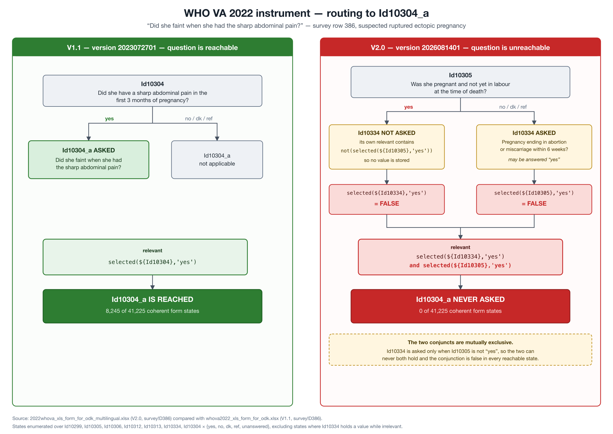

# WHO V2.0 defect — `Id10304_a` relevance is unsatisfiable

WHO's multilingual release, `2022whova_xls_form_for_odk_multilingual.xlsx`
(form title *2022 WHO Verbal Autopsy instrument V2.0*, version `2026081401`,
sha256 `05e123884c04`), makes `Id10304_a` unreachable. The change is an
upstream authoring defect, not a revision of clinical intent, and it is the
reason decision E7/E8 (`digitva-13x`) cannot adopt V2.0 verbatim.

**Every deployed DigitVA form is unaffected.** See *Deployed forms* below.



## The change

`Id10304_a` — "Did she faint when she had the sharp abdominal pain?"
(`survey` row 386 in both workbooks) is the fainting question for suspected
ruptured ectopic pregnancy; its own guidance distinguishes fainting from the
dizziness common in normal pregnancy.

| Release | `relevant` |
| --- | --- |
| V1.1 `2023072701` | `selected(${Id10304},'yes')` |
| V2.0 `2026081401` | `selected(${Id10334},'yes') and selected(${Id10305},'yes')` |

## Why it cannot fire

`Id10334` ("Did she have a pregnancy that ended in an abortion or miscarriage
within 6 weeks before her death?", row 381) carries this relevance, unchanged
between the two releases:

```
not(selected(${Id10312}, 'yes')) and not(selected(${Id10305}, 'yes')) and
not(selected(${Id10299}, 'yes') and ${ageInYears2}>49) and
not(selected(${Id10306}, 'yes')) and not(selected(${Id10313}, 'yes'))
```

`Id10334` is therefore asked **only when `Id10305` is not "yes"**. V2.0's rule
requires `Id10305` to *be* "yes". The two conjuncts are mutually exclusive: in
any state where `Id10305` = "yes", `Id10334` is irrelevant and holds no value,
so `selected(${Id10334},'yes')` is false.

The failure is silent. The form validates, deploys and runs normally; the
omission surfaces only as a uniformly empty field, which a cause-of-death
algorithm or physician reviewer reads as absent rather than negative.

## Reproduction

Enumerated with this repo's own `app/services/xform_expression_evaluator`
over all 5^7 combinations of the seven questions involved, across
`yes` / `no` / `dk` / `ref` / unanswered, discarding states in which `Id10334`
holds a value while its own relevance is false:

```
coherent states examined:            41225
V1.1 rule reaches Id10304_a in:       8245
V2.0 rule reaches Id10304_a in:          0
```

```python
import itertools
from app.services.xform_expression_evaluator import (
    evaluate_expression, parse_expression, as_boolean,
)

REL_334 = ("not(selected(${Id10312}, 'yes')) and not(selected(${Id10305}, 'yes')) and "
           "not(selected(${Id10299}, 'yes') and ${ageInYears2}>49)   and "
           "not(selected(${Id10306}, 'yes')) and not(selected(${Id10313}, 'yes'))")
AST334 = parse_expression(REL_334)
A11 = parse_expression("selected(${Id10304},'yes')")
A20 = parse_expression("selected(${Id10334},'yes') and selected(${Id10305},'yes')")

VALS = ["yes", "no", "dk", "ref", ""]
names = ["Id10312", "Id10305", "Id10299", "Id10306", "Id10313", "Id10334", "Id10304"]

total = v11 = v20 = 0
for combo in itertools.product(VALS, repeat=len(names)):
    data = dict(zip(names, combo)) | {"ageInYears2": 30}
    # The form's own invariant: Id10334 holds a value only when it is relevant.
    if not as_boolean(evaluate_expression(AST334, data)) and data["Id10334"] != "":
        continue
    total += 1
    v11 += as_boolean(evaluate_expression(A11, data))
    v20 += as_boolean(evaluate_expression(A20, data))
print(total, v11, v20)
```

The only states satisfying V2.0's rule (3,125 of the unfiltered 78,125) are
those where a previously entered `Id10334` answer persists after `Id10305` is
changed to "yes". ODK clears answers that become irrelevant, and DigitVA
strips irrelevant answers at final submit, so those states do not reach
storage.

## Deployed forms

All ten project workbooks in this directory were downloaded from their ODK
Central deployments, so this is a check of what is live, not of a reference
copy. Each carries the **V1.1** rule, and the full eight-question relevance
neighbourhood (`Id10304_a`, `Id10304`, `Id10334`, `Id10305`, `Id10299`,
`Id10306`, `Id10312`, `Id10313`) is byte-identical to `whova2022_xls_form_for_odk.xlsx`:

`JIPMER_DS`, `KA01_DS`, `KEM_VAADU`, `KL01_DS`, `ML01_ICMRVA`, `ND01_ICMRVA`,
`OD01_ICMRVA`, `PY01_ICMRVA`, `RJ01_ICMRVA`, `TR01_DS`.

The shipped instrument bundle also carries the V1.1 rule, so no change is
needed to remain correct.

Collected data is consistent with the mutual exclusivity. Across 8,237
submissions with an active payload version:

| | count |
| --- | --- |
| reach `Id10305` | 2,523, of which 9 answered "yes" |
| reach `Id10334` | 2,507, of which 0 answered "yes" |
| both `Id10334` = "yes" and `Id10305` = "yes" | 0 |

Read this as corroboration only. `Id10304` = "yes" never occurred in this
dataset, so `Id10304_a` was rare under V1.1 here too, and the field data
cannot quantify what V2.0 would cost. The structural argument above is the
evidence.

## Status

A report to WHO was drafted 2026-09-20 and is **not yet sent**; update this
line with the date and the reply when it is. Until a corrected release,
adopting V2.0 must retain V1.1's condition for `Id10304_a` as a recorded
`DEVIATION`. Tracked as `digitva-mdj`, which stays open until WHO answers and
blocks `digitva-13x`.
