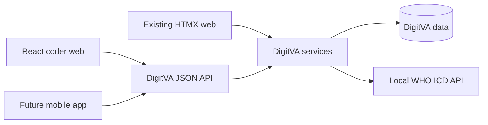

# API-First Coder Workflow and React Web Migration Plan

## Decision and boundary

Planning only; application implementation has not started. The owner wants
the **entire coder journey from starting a form** to use DigitVA APIs, with
the web frontend consuming those APIs and a future mobile app able to use
the same server-side workflow. The owner prefers React for the coder web
client. Existing HTMX routes must work alongside the new JSON contract
during migration. This plan covers coder allocation, case opening, category
review, notes, NQA/Social Autopsy, SmartVA guidance, COD entry, finalization,
Not Codeable and recode. The reviewer frontend and native mobile client are
later scopes, but the domain services should not be tied to React or HTMX.

`docs/planning/coder-web-and-api-contracts.md` specifies the current
HTML/HTMX behavior and proposed JSON endpoints side by side. The
DORIS-specific settings, data model and clinical choices remain in
`docs/planning/project-cod-masking-doris-plan.md`. No API endpoint in those
documents should be described as implemented until it exists and passes
contract tests.

The [certificate UI contract](../kb/doris-certificate-ui-contract.md) and
[observed WHO web trace](../kb/doris-web-behavior-and-api-trace.md) define the
Help form and its later browser/mobile interaction boundary.

## Current state and gaps

- `app/routes/api/coding.py` already provides `/api/v1/coding` JSON APIs
  for allocation, available cases, stats, history, projects and recode.
  `app/static/js/va_code_dashboard.js` uses those APIs, although some
  pick/recode controls still post to legacy HTML routes.
- `app/routes/coding.py` opens or resumes the HTML case shell through
  `app/services/coding_service.py:render_va_coding_page()`. Opening also
  queues payload repair once; a future read API must not repeat that side
  effect on every fetch.
- `app/routes/va_form.py` currently combines
  `GET|POST /vaform/<sid>/<partial>` with category reads, PII redaction,
  evidence/attachments, SmartVA, notes, Step 1, final COD and Not Codeable.
  Finalization also changes workflow, authority, allocation, audit and
  caches. This is the main extraction risk.
- NQA, Social Autopsy, ICD search/provenance, workflow events and reviewer
  actions already have JSON API islands. Reuse those endpoints and domain
  services; do not duplicate them in a new coder facade.
- Browser authentication uses Flask-Login sessions and CSRF. A native app
  authentication mechanism is not currently present, so an API-first web
  workflow alone does not make production mobile access ready.

## Target shape

The Flask server remains the authority for access, project settings,
workflow state, classification rules, WHO code/URI verification, DORIS and
CoDEdit processing, and final human COD persistence. React owns only web
presentation and transient form state. New JSON APIs return semantic case
data and accept mode-specific human decisions. HTML/HTMX and React call the
same Python service commands during the transition; neither browser
framework is a source of clinical truth.

The public Help page is the first integration proof: a DigitVA-owned,
editable certificate form calls bounded same-origin APIs for ICD-11
condition selection, DORIS and CoDEdit. It can load and edit the six
synthetic certificates in `resource/doris_help_examples.json` or start
blank, and displays **live** outputs, including warnings, rejection, both
reports and DORIS rule table/flow/sequence views. It proves the UI and WHO
API adapter without touching clinical submissions. WHO's web app is a
behavior reference, not an integration dependency.
After this proof is reviewed, build clinical APIs and migrate the coder
journey in slices. Do not begin project-setting or clinical DORIS work
before the public proof has passed its gate.

## React and WHO component integration

Use one versioned React root for the coder case area. Keep the current
Jinja page shell and HTMX screens available while each slice is verified.
Scope CSS and WHO ECT lifecycle to the React root;
do not allow React and HTMX to mutate the same form subtree. WHO ECT 1.8
has a published React **integration example** that binds its JavaScript
tool after mounting. It is a web DOM integration, not a native mobile
component. A future WHO web component can be wrapped behind the same
code-picker interface without changing server API contracts.

Build the Help `CertificateEditor` and `DorisResults` with plain JavaScript
inside the existing Help shell, using the vendored WHO ECT and Mermaid assets.
This proof freezes the JSON and state contract, not React components. The
later clinical React client implements that same contract after its build
and CSP choices are specified. The editor owns an input revision so an edit
clears the displayed result and a delayed response cannot overwrite a newer
certificate. Keep the WHO ECT instance scoped to the active condition and
destroy it when that condition is removed.

WHO DORIS exposes a standalone web app and ICD API, rather than a documented
embeddable React package. DigitVA will implement its own certificate editor
using WHO's published certificate schema and the observed web interaction.
The existing ECT is the first browser code-picker choice for each condition;
it already returns complete expressions and is server-validated. In the
WHO DORIS web app, term typing called MMS `search`, code typing called
`codeinfo`, and a selection became a removable code chip. Record and compare
those behaviors in the Help proof. WHO's separate
[API visualization sample](https://github.com/ICD-API/ICD-API-DORIS-Samples)
shows how to derive rule-flow and sequence diagrams from `tabularReport`.
Its functions parsed all six synthetic examples from the pinned local WHO
image, so the Help runner should display those views alongside every live
DORIS/CoDEdit response field. The sample has no declared license; inspect
reuse rights before copying source, and safely render WHO-supplied text.

## Work packages and order

1. **Freeze contracts and policy.** Review the parallel HTML/HTMX and JSON
   contracts, current reviewer visibility, masking, all three COD modes,
   error codes, payload version and workflow state checks, and no-retention
   Help behavior. Freeze phase-0 request/response fields, status values,
   error envelopes and numeric limits in contract tests before the Help UI.
   Update `docs/policy` before implementation and `docs/current-state`
   when behavior changes.
2. **Public Help proof first.** Add a bounded same-origin public
   config/search/selection/process API and DigitVA-owned certificate editor.
   Load and edit adult, neonatal death, child, maternal, stillbirth and
   mixed-tuberculosis
   examples; create a new certificate; search ICD-11 codes in condition rows;
   show live DORIS and CoDEdit outputs with table/flow/sequence views. Verify
   conditional questions, rejection, warnings, stale-result handling and the
   code/URI trust boundary. Include the normalized terminology API used by
   future mobile clients; ECT alone does not prove that API. Verify the
   bounded execution pool, cross-worker concurrency cap, total request
   deadline and content-free access logging before exposing the public page.
   This phase needs no clinical migration.
3. **Shared access and read services.** Extract one coder-case access
   decision covering role, form/site/project/language, active allocation,
   retired form, recode/demo and payload revision. Create redacted semantic
   serializers for categories, attachment descriptors and COD context. Add
   case bootstrap/category/context/note read APIs. Preserve the one-time
   open-repair behavior at entry.
4. **Extract domain writes.** Move Step 1, note, final COD and Not Codeable
   business operations out of `app/routes/va_form.py` into shared services.
   Have the legacy HTML route call those services before adding new JSON
   mutations. Preserve every workflow transition, audit event, final-COD
   authority update, allocation release, cache invalidation, NQA/Social
   gate, demo expiry and best-effort ODK side effect.
5. **Add write APIs and move the coder web client.** Add the proposed
   `/api/v1/coding/cases/{sid}` mutations with server-derived mode,
   expected payload version, workflow state, allocation ID and structured
   errors. Switch the
   React coder path from start/open through finalization one section at a
   time. Keep HTML/HTMX compatibility until parity and browser tests pass.
6. **Add project settings and clinical DORIS.** Apply the additive migration
   and persistence from the DORIS plan only after the Help proof and shared
   finalization service are sound. Clinical DORIS entry also depends on a
   the reusable DigitVA certificate editor and local WHO processing adapter
   verified in Help. The clinical API requires active allocation. DORIS/CoDEdit
   results and the MO final underlying COD remain separate.
7. **Mobile enablement later.** Design supported OIDC/OAuth login with PKCE,
   device/token policy and narrowly scoped bearer authorization. Specify
   retry/idempotency and any offline allocation/sync rules before releasing
   a native client. Its code picker uses DigitVA terminology/provenance
   APIs; it does not reuse the ECT browser DOM.
8. **Retire compatibility selectively.** Remove obsolete HTML mutation
   branches only after the React web client covers every coder path and
   parity is verified. Retain read-only HTML views where useful.

## Migration and data impact

The public Help proof and coder read/API extraction require no clinical
schema migration. Project settings and DORIS final-assessment fields require
the additive, reversible migration described in the DORIS plan, chained
from the committed migration head at implementation time. Do not rewrite
historical COD rows, ODK source data or recode episodes. The current masked
simple flow remains the default. The present masked reviewer screen already
shows coder COD before reviewer Step 1; the owner chose to preserve that
visibility.

## Verification gates and risks

- Contract tests compare web/HTMX and JSON authorization, PII redaction,
  category values, attachments, state transitions, audit, allocation,
  authority, errors and saved rows for equivalent actions.
- Test stale payload version/workflow state, released allocation, retries after
  uncertain final response, session expiry, form/site/project/language
  access, retired forms, demo/recode and upstream payload changes.
- Test all three approved COD modes, ICD-10 and complete ICD-11
  expressions/provenance, NQA/Social gates, and Not Codeable when ODK update
  fails. CoDEdit findings never block the human final COD.
- Test six Help certificates against the pinned local WHO image and through
  the public Help page, including edited and blank-start forms. Additional
  inputs must cover multiple conditions
  per Part I line, a code cluster, unknown fields, rejection, timeout and
  malformed output. Validate parsed rule rows and both Mermaid views against
  the pinned output, with readable/raw report fallback if visualization
  fails. Check the browser network and application logs for
  accidental medical-text retention.
- Verify React/ECT callback lifecycle for any dynamic ICD fields, input
  revision matching for delayed processing, accessible keyboard use, and
  mobile viewport behavior. Run focused Docker tests on a dedicated test DB,
  then the combined suite and browser smoke before any implementation commit.

The largest engineering risks are duplicated write logic, bypassing current
PII redaction in JSON, trusting browser-supplied DORIS results, and treating
the current Flask session as mobile authentication. The API must return
permitted data rather than relying on the client to hide restricted data.
An outage of the whole local WHO service still blocks current ICD-11 final
code provenance; DORIS-only failure may be advisory when codeinfo works.

## Sources

- `app/routes/api/coding.py`, `app/routes/coding.py`,
  `app/routes/va_form.py`, `app/services/coding_service.py`,
  `app/services/coder_workflow_service.py`, and
  `app/static/js/va_code_dashboard.js` in this repository.
- [WHO ECT 1.8 React, Angular and Vue examples](https://icd.who.int/docs/icd-api/icd11ect-1.8/Samples/).
- [WHO ECT 1.8 browser integration contract](https://icd.who.int/docs/icd-api/icd11ect-1.8/EmbeddedCodingTool/).
- [WHO DORIS web report views](https://icd.who.int/docs/doris/en/doris-web/).
- [WHO DORIS API](https://icd.who.int/docs/icd-api/DORISSupport/).
- [WHO DORIS API visualization sample](https://github.com/ICD-API/ICD-API-DORIS-Samples).
