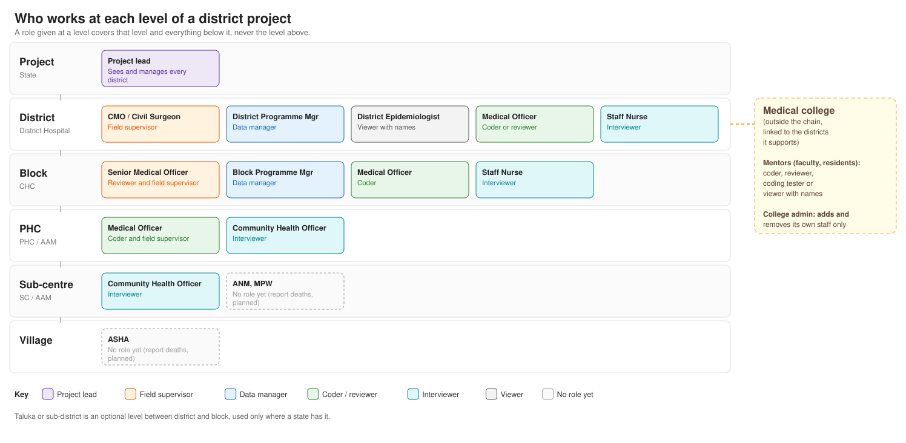

# Who can do what in DigitVA

This page explains, in plain language, what each person can and cannot do in
DigitVA. It is written for principal investigators, district Chief Medical
Officers and Civil Surgeons, and medical college faculty who mentor a
district.

DigitVA runs two kinds of project. A **site project** is a research study
with a few field sites. A **district project** follows the public health
system: district, block (CHC), PHC and sub-centre.

## Three rules for everyone

Nobody gets access because of their job title. Each person is given a role,
and each role is given for a place. A role covers everything inside that
place, and nothing outside it or above it.

A person can hold more than one role. A doctor who both codes and reviews is
given both. One role never includes another, so a senior officer cannot code
unless they are also given the coder role.

Names of the deceased and the family, ID numbers, and who collected, coded
or reviewed a death are personal details. Every role sees them except the
plain viewer.

## Roles in a site project

In a site project, a role is given either for the whole project or for one
site.

**Project PI**
- Can set up the project and its sites.
- Can give people their roles in the project.
- Can see the progress of every site.
- Cannot code or review deaths unless also given that role.

**Site PI**
- Can see their site's progress: deaths received, deaths with an agreed
  cause, deaths that could not be coded, and each coder's work.
- Cannot change any data.
- Cannot code, review or give anyone a role.

**Data manager**
- Can see every death and every progress figure for their site or project.
- Can check incoming cases and mark a case as not fit for coding.
- Can bring in the latest interviews.
- Can add coders, coding testers and other data managers at their own site
  or project.
- Cannot code or review deaths.
- Cannot give anyone a PI or reviewer role.

**Coder**
- Can read an interview and assign the cause of death, for deaths at their
  site or project and in their language.
- Can correct their own coding within 24 hours.
- Cannot review deaths, change the interview, or give anyone a role.

**Reviewer**
- Can code a sample of deaths a second time, independently, once the
  coder's 24 hours have passed.
- Cannot do the first coding of a death unless also given the coder role.
- Cannot change the interview or give anyone a role.

**Coding tester**
- Can code deaths to check that coding works, even while coding is switched
  off for everyone else.
- Their work does not count toward results.
- Cannot review deaths or give anyone a role.

**Interviewer**
- Can register a death and interview the family, on the web or the mobile
  app.
- Can see and follow up their own cases.
- Cannot code or review deaths.

**Viewer**
- Can see lists of deaths and progress figures, and open a death to read it.
- Names and other personal details are hidden.
- Cannot change anything.

**Viewer with names**
- Same as a viewer, but sees names and other personal details.
- Cannot change anything.

## Roles in a district project

In a district project, a role is given for a place in the health system: the
whole project, a district, a block, or a PHC. A role for the district covers
every CHC, PHC and sub-centre in it. A role for one PHC covers that PHC and
its sub-centres, but not the neighbouring PHC and not the district above.
There is no site PI; the project lead covers every district.

**Project lead** (State nodal officer or principal investigator)
- Can see every screen, for every district in the project.
- Can set up the project, its districts and its facilities.
- Can give people their roles.
- Can do everything a District Programme Manager can do, in every district.
- Cannot code or review deaths unless also given that role.

**Field supervisor** (CMO or Civil Surgeon for the district, Senior Medical
Officer for a block, Medical Officer for a PHC)
- Can see every death registered and every interview in their area.
- Can sort out problems an interviewer has flagged.
- Can cancel or reopen a case, and mark duplicates.
- Cannot interview, code or review unless also given that role.

**Data manager** (District Programme Manager for the district, Block
Programme Manager for a block)
- Can see every death and every progress figure in their area.
- Can check incoming cases and mark a case as not fit for coding.
- Can correct which facility a death belongs to.
- Can see deaths that arrived without a facility, from anywhere in the
  project, and place them at the right facility in their own area.
- Can bring in the latest version of a single interview.
- Can give staff in their area the role of interviewer, coder, reviewer,
  coding tester or viewer.
- Cannot code or review deaths.
- Cannot make anyone a data manager, field supervisor, project lead or
  administrator, or give a role outside their own area.

**Coder** (Medical Officer)
- Can assign the cause of death for deaths at their own facility and below
  it, in their language.
- Can correct their own coding within 24 hours.
- Cannot review deaths, change the interview, or give anyone a role.

**Reviewer** (usually a Senior Medical Officer)
- Can code a sample of deaths in their area a second time, independently.
- Cannot do the first coding of a death unless also given the coder role.

**Interviewer** (CHO or Staff Nurse)
- Can register a death and interview the family.
- Can see and follow up their own cases.
- Cannot code or review deaths.

**Viewer with names** (for example the District Epidemiologist)
- Can see every death and every figure in their area, with names, and open a
  death to read it.
- Cannot change anything.

**Viewer**
- Same as a viewer with names, but names and other personal details are
  hidden.

**ANM, MPW and ASHA**
- Have no role yet. A role for reporting deaths is planned.

### Medical college mentors

A medical college is not part of the district's chain of facilities. It is
linked to the districts it supports.

**Mentor** (faculty or resident)
- Can be given one of four roles, only in districts their college supports:
  coder, reviewer, coding tester, or viewer with names.
- Their coding and review count toward the district's results, like any
  doctor's.
- Are listed separately from district staff and not counted in the
  district's staff numbers.
- Cannot manage data, supervise field work or interview.
- Need a separate account for any work they also do for the district.

**College admin**
- Can add and remove the college's own staff.
- Cannot give anyone a role. Mentors get their roles from the project lead
  or from a District Programme Manager of a district the college supports.

## What nobody can do

- See a site, district, block or PHC they were not given a role for.
- See upwards from their own place.
- Code or review without a coder or reviewer role, however senior they are.
