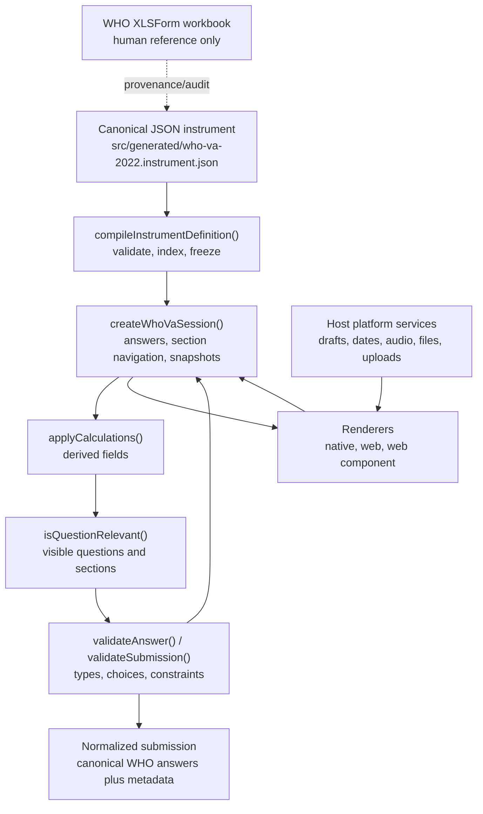
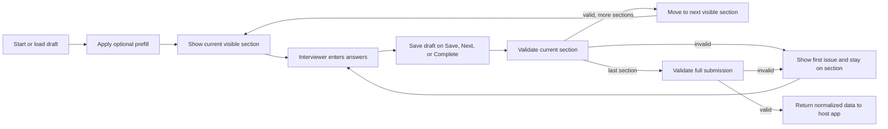
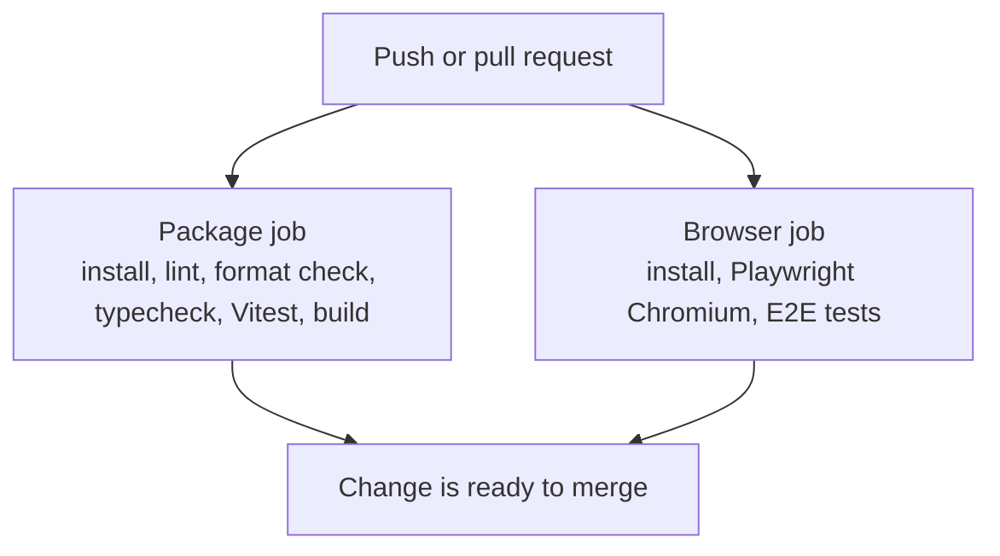
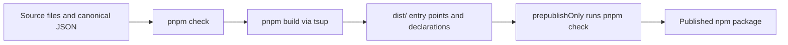

# Project workflow

This project is a TypeScript package for the 2022 WHO verbal autopsy instrument.
The runtime workflow starts from the checked-in JSON instrument, passes through a
shared headless engine, and is then rendered by web, native, or custom-element
entry points.

## Runtime workflow



The workbook is not parsed by runtime code, tests, or builds. It remains in the
repository only so humans can audit the checked-in contract against the source
form.

## Interview workflow



The package stops at validated, normalized questionnaire data. A host
application remains responsible for user identity, encryption, sync, retention,
upload authorization, and server storage.

## Development workflow

1. Install the pinned toolchain.

   ```bash
   corepack enable
   pnpm install
   pnpm exec playwright install chromium
   ```

2. Run the local demo while developing UI or interview behavior.

   ```bash
   pnpm dev
   ```

   The Vite demo runs at `http://127.0.0.1:5173`.

3. Make focused changes in the matching layer.

   | Change type         | Main files                                                                                   |
   | ------------------- | -------------------------------------------------------------------------------------------- |
   | Instrument contract | `src/generated/who-va-2022.instrument.json`, `src/generated/who-va-2022.question-audit.json` |
   | Engine behavior     | `src/engine/`, `src/core.ts`, `src/instrument.ts`                                            |
   | Shared controls     | `src/ui/question-controls.tsx`, `src/ui/question-control-support.ts`                         |
   | Web rendering       | `src/web.tsx`, `src/web-component.tsx`, `src/web-attachments.ts`                             |
   | Native rendering    | `src/native.tsx`, `src/native-attachments.ts`                                                |
   | Examples and demo   | `examples/`, `demo/`                                                                         |

4. Run the narrowest useful tests while iterating.

   ```bash
   pnpm test
   pnpm typecheck
   ```

5. Before opening or merging a change, run the package gate.

   ```bash
   pnpm check
   ```

6. For browser-visible behavior, navigation, validation focus, or attachment UI,
   run the full browser suite too.

   ```bash
   pnpm check:all
   ```

## Test and CI workflow



CI runs on pull requests and pushes to `main`.

The `package` job runs `pnpm check`, which includes:

- `pnpm lint`
- `pnpm format:check`
- `pnpm typecheck`
- `pnpm test`
- `pnpm build`

The `browser` job installs Chromium with Playwright and runs `pnpm test:e2e`.

## Build and release workflow



The package publishes four ESM entry points:

- `@drguptavivek/who-2022-va`
- `@drguptavivek/who-2022-va/native`
- `@drguptavivek/who-2022-va/web`
- `@drguptavivek/who-2022-va/web-component`

Before release, confirm the root bundle does not pull in React, browser APIs,
React Native APIs, Excel parsing, or the retained workbook.
